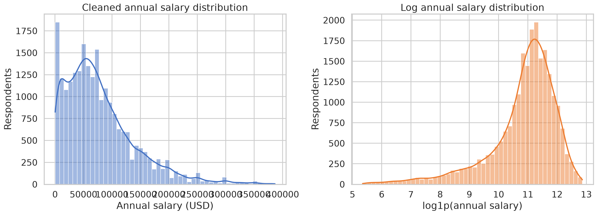
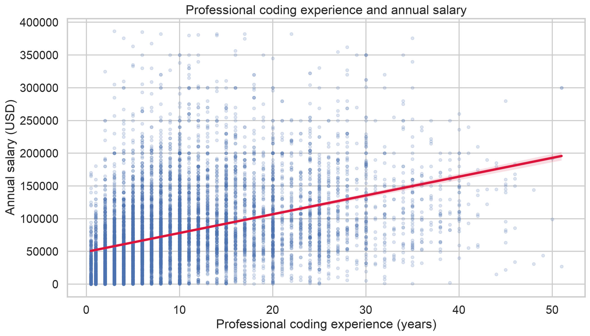
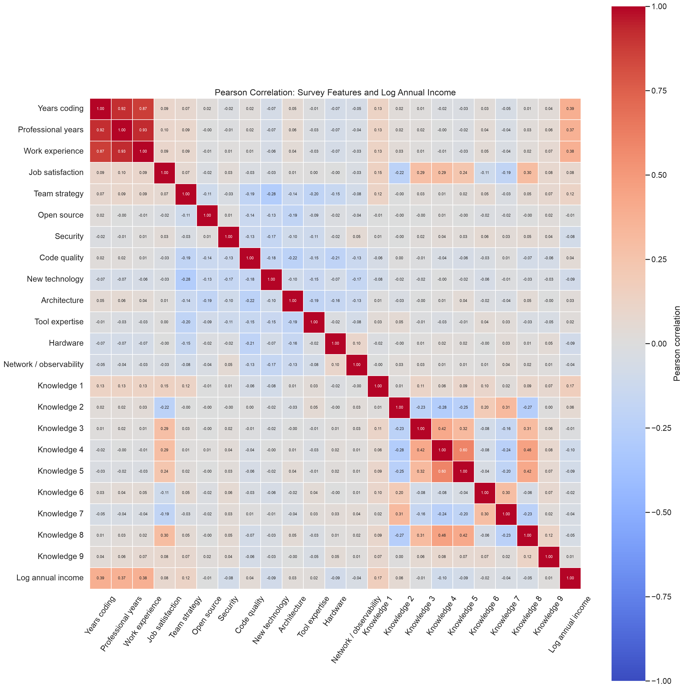
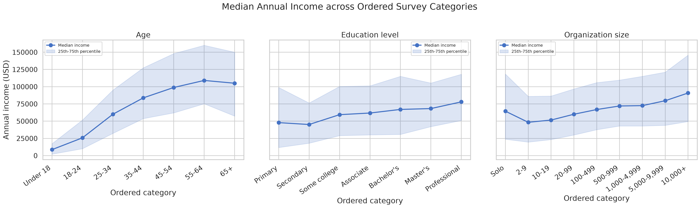
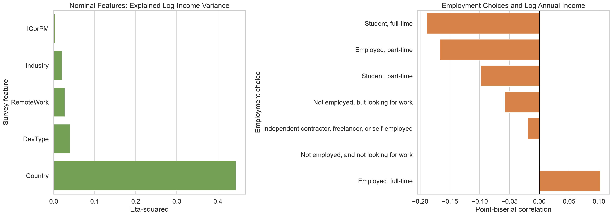

# Stack Overflow Survey 2024 income 분석·예측

> 전체 데이터 실행 결과입니다.

## 0. Pandas·Polars 로딩 비교

- Pandas shape: `[65437, 114]`
- Polars shape: `[65437, 114]`
- shape·열 순서 일치: `True`
- 결측 셀: Pandas `2,890,957` / Polars `2,890,957`
- 중복 ResponseId: Pandas `0` / Polars `0`
- 유효 소득 행: Pandas `23,435` / Polars `23,435`
- 핵심 품질 요약 일치: `True`
- 로딩 시간(워밍업 1회 + 순서 교대 4회 반복 측정의 중앙값): Pandas `0.807초` / Polars `0.069초`
- 로딩 후 DataFrame 추정 크기: Pandas `450.5MB` / Polars `145.1MB`

> **해석:** 정합성 지표는 두 엔진이 동일한 파일을 올바르게 읽었는지
> 확인하는 기준이다. 실제 성능 비교에서는 이번 실행의 `Polars`가
> 로딩 속도가 약 11.76배 더 빨랐고, `Polars`가 DataFrame 크기가
> 약 3.10배 더 작았다. 시간은 워밍업 뒤 시작 엔진을 교대해 측정한 중앙값이며,
> 파일 캐시·머신 상태에 따라 달라질 수 있다. 크기는 로딩 중 피크 메모리가
> 아니라 로딩이 끝난 객체의 추정치이므로 절대적인 메모리 사용량으로
> 해석하지 않는다.

## 1. 원본 데이터 EDA

| item                   |   value |
|:-----------------------|--------:|
| rows                   |   65437 |
| columns                |     114 |
| duplicate_response_ids |       0 |
| valid_salary_rows      |   23435 |
| salary_missing_rows    |   42002 |

열별 dtype·결측률·고유값은 `data/processed/raw_column_profile.csv`, 원본
급여 분포는 `raw_salary_summary.csv`에 저장했다.

> **해석:** 전체 65,437개 응답 중 income이 있고 0보다 큰 행은
> 23,435개(35.8%)다. income 문항은 선택 응답이므로,
> 모델의 학습 모집단은 전체 설문 응답자가 아니라 income을 제출한
> 응답자로 한정된다.

## 2. 결측치·중복·급여 이상치 처리

| item                               |     value |
|:-----------------------------------|----------:|
| rows_before                        |  65437    |
| duplicate_response_ids             |      0    |
| missing_or_nonpositive_salary_rows |  42002    |
| salary_lower_1pct_bound            |    207.68 |
| salary_upper_1pct_bound            | 393751    |
| salary_outlier_rows                |    470    |
| rows_after                         |  22965    |
| total_missing_cells_after          | 713934    |

ResponseId 중복, 급여 결측·0 이하, 유효 급여의 상·하위 1% 밖 응답을 제거했다.
입력 변수의 결측은 행을 지우지 않고 모델 Pipeline 내부에서 대치했다.

> **해석:** EDA에서는 유효 income의 470개(2.0%)만
> 이상치로 제외했다. 이 제거는 그래프와 기술통계가 극단값에
> 지나치게 좌우되는 것을 줄이기 위한 것이다. 모델은 분할 후 train에서
> IQR 경계를 계산해 train·test에 동일하게 적용한다. 정제 test를 기본
> 평가 대상으로 삼되, 전체 test 결과도 별도 지표로 함께 보고한다.

## 3. 정제 데이터 EDA·기술통계

|                     |   count |     mean |      std |    min |      25% |      50% |       75% |       max |   median |
|:--------------------|--------:|---------:|---------:|-------:|---------:|---------:|----------:|----------:|---------:|
| YearsCode_num       |   22924 |    15.06 |     9.87 |   0.5  |     8    |    12    |     20    |     51    |    12    |
| YearsCodePro_num    |   22885 |    10.21 |     8.6  |   0.5  |     4    |     8    |     14    |     51    |     8    |
| WorkExp_num         |   15859 |    11.08 |     8.86 |   0    |     4    |     9    |     15    |     50    |     9    |
| Knowledge_1_score   |   15591 |     1.09 |     0.94 |  -2    |     1    |     1    |      2    |      2    |     1    |
| Knowledge_2_score   |   15332 |     0.23 |     1.15 |  -2    |    -1    |     0    |      1    |      2    |     0    |
| Knowledge_3_score   |   15358 |     0.27 |     1.05 |  -2    |    -1    |     0    |      1    |      2    |     0    |
| Knowledge_4_score   |   15339 |     0.44 |     0.99 |  -2    |     0    |     1    |      1    |      2    |     1    |
| Knowledge_5_score   |   15258 |     0.73 |     0.93 |  -2    |     0    |     1    |      1    |      2    |     1    |
| Knowledge_6_score   |   15257 |     0.34 |     1.06 |  -2    |     0    |     0    |      1    |      2    |     0    |
| Knowledge_7_score   |   15212 |     0.43 |     1.1  |  -2    |     0    |     1    |      1    |      2    |     1    |
| Knowledge_8_score   |   15213 |     0.27 |     1.09 |  -2    |    -1    |     0    |      1    |      2    |     0    |
| Knowledge_9_score   |   15163 |    -0.26 |     1.31 |  -2    |    -1    |     0    |      1    |      2    |     0    |
| Age_order           |   22956 |     2.44 |     1.02 |   0    |     2    |     2    |      3    |      6    |     2    |
| EdLevel_order       |   22759 |     3.94 |     1.25 |   0    |     4    |     4    |      5    |      6    |     4    |
| OrgSize_order       |   22622 |     4.06 |     2.22 |   0    |     3    |     4    |      6    |      8    |     4    |
| ConvertedCompYearly |   22965 | 78606.2  | 61963.6  | 209    | 33758    | 65000    | 107406    | 386662    | 65000    |
| log_salary          |   22965 |    10.83 |     1.17 |   5.35 |    10.43 |    11.08 |     11.58 |     12.87 |    11.08 |

> **해석:** 정제 income의 평균은 $78,606, 중앙값은
> $65,000로 평균이 더 크다. 이는 고소득 응답이 오른쪽 긴 꼬리를
> 만든다는 뜻이며, 달러 단위 income과 `log1p` income을 함께 확인한 이유다.

## 4. 수치형·순서형 응답과 log income

### 4.1 연속형·Likert 점수 Pearson 상관 Top 3

| feature          |   valid_rows |   pearson_r |   absolute_r |
|:-----------------|-------------:|------------:|-------------:|
| YearsCode_num    |        22924 |      0.3878 |       0.3878 |
| WorkExp_num      |        15859 |      0.3809 |       0.3809 |
| YearsCodePro_num |        22885 |      0.3714 |       0.3714 |

Pearson 상관계수는 선형 관련성이며 인과관계를 의미하지 않는다.
이 Top 3는 EDA 요약이며 모델 변수 제거 기준으로 사용하지 않았다.

> **해석:** 가장 큰 단변량 상관은 `YearsCode_num`의
> r=0.388로, 경력이 늘수록 log income이 높아지는 양의 관계가 있다.
> 다만 계수가 1에 가깝지 않으므로 경력만으로 income을 정확히 예측할 수는
> 없고, 국가·직무·교육·조직 정보를 함께 고려해야 한다.

### 4.2 순서형 선택지 Spearman 순위 상관

| feature           |   valid_rows |   spearman_rho |    p_value |   p_value_bonferroni | significant_bonferroni_0_05   |
|:------------------|-------------:|---------------:|-----------:|---------------------:|:------------------------------|
| Age               |        22956 |         0.4169 | 0          |           0          | True                          |
| Organization size |        22622 |         0.1958 | 2.924e-194 |           8.772e-194 | True                          |
| Education level   |        22759 |         0.1007 | 2.185e-52  |           6.555e-52  | True                          |

`Age`, `EdLevel`, `OrgSize`는 순서만 보존한 점수로 변환했다.
`Prefer not to say`, `Something else`, `I don’t know`에는 임의의 순서를
부여하지 않고 이 분석에서 제외했다.
순서형 3개 반복 검정의 우연한 유의성을 줄이기 위해 Bonferroni 보정 p-value를
함께 제시했다.

> **해석:** 순서형 응답 중 절대 순위 상관이 가장 큰 변수는
> `Age`(Spearman rho=0.417)다.
> Spearman은 각 범주 간 거리가 같다고 가정하지 않고 income이 순서에 따라
> 일관되게 증가·감소하는지를 평가한다.

## 5. 범주형 변수별 급여 중앙값·분포

### 국가 Top 10

| feature   | category                                             |   respondents |   median_salary |   mean_salary |      q25 |    q75 |
|:----------|:-----------------------------------------------------|--------------:|----------------:|--------------:|---------:|-------:|
| Country   | United States of America                             |          4513 |          140000 |      147592   | 100000   | 184000 |
| Country   | Israel                                               |           216 |          113334 |      110516   |  80953   | 143691 |
| Country   | Switzerland                                          |           383 |          111417 |      117156   |  89134   | 141508 |
| Country   | Singapore                                            |            53 |          103482 |      125250   |  74285   | 158918 |
| Country   | Australia                                            |           503 |           95135 |       98562.2 |  72673   | 118919 |
| Country   | Ireland                                              |           120 |           91295 |       97629.3 |  59878.5 | 124860 |
| Country   | Denmark                                              |           211 |           88993 |       89713.1 |  69985   | 113762 |
| Country   | Canada                                               |           860 |           87231 |       96787.6 |  65424   | 115218 |
| Country   | United Kingdom of Great Britain and Northern Ireland |          1373 |           83439 |       96377.3 |  58344   | 119108 |
| Country   | Norway                                               |           224 |           79552 |       83503.4 |  65514   |  93942 |

### 직무 Top 10

| feature   | category                             |   respondents |   median_salary |   mean_salary |     q25 |    q75 |
|:----------|:-------------------------------------|--------------:|----------------:|--------------:|--------:|-------:|
| DevType   | Developer Advocate                   |            51 |        121018   |      125071   | 62154   | 173627 |
| DevType   | Senior Executive (C-Suite, VP, etc.) |           280 |        114649   |      131915   | 66633.2 | 188918 |
| DevType   | Engineering manager                  |           521 |        114365   |      125460   | 75184   | 165000 |
| DevType   | Developer Experience                 |            84 |        107478   |      122036   | 60133.2 | 167500 |
| DevType   | Engineer, site reliability           |           127 |         96666   |      109484   | 52573   | 158944 |
| DevType   | Cloud infrastructure engineer        |           275 |         95796   |      104149   | 55976   | 139240 |
| DevType   | Blockchain                           |            85 |         85536   |       95834.4 | 38192   | 135332 |
| DevType   | Other (please specify):              |           637 |         80555   |       95576.5 | 44818   | 130847 |
| DevType   | Security professional                |           108 |         79497.5 |       99300.1 | 49898.2 | 129536 |
| DevType   | Product manager                      |            86 |         78666   |       88475.1 | 47222.8 | 110622 |

각 범주의 중앙값·평균·25·75분위수 전체는 `categorical_salary_summary.csv`에 저장했다.

> **해석:** 최소 20개 응답 기준을 만족한 범주 중 income 중앙값이
> 가장 높은 국가는 `United States of America`
> ($140,000, n=4,513),
> 직무는 `Developer Advocate`
> ($121,018, n=51)다.
> 국가 간 물가·환율·직무 구성이 다르므로 이 순위를 개인의 인과적
> 소득 효과로 해석하면 안 된다.

### 5.1 명목형 응답 효과크기·Kruskal-Wallis 검정

| feature    |   valid_rows |   group_count |   eta_squared |    kruskal_h |    p_value |   p_value_bonferroni | significant_bonferroni_0_05   |
|:-----------|-------------:|--------------:|--------------:|-------------:|-----------:|---------------------:|:------------------------------|
| Country    |        22441 |            77 |      0.4443   |    1.135e+04 | 0          |           0          | True                          |
| DevType    |        22918 |            33 |      0.04035  | 1158         | 7.504e-223 |           3.752e-222 | True                          |
| RemoteWork |        22957 |             3 |      0.0271   |  826.8       | 2.969e-180 |           1.485e-179 | True                          |
| Industry   |        15692 |            15 |      0.02058  |  363.4       | 6.274e-69  |           3.137e-68  | True                          |
| ICorPM     |        15866 |             2 |      0.003141 |   80.98      | 2.28e-19   |           1.14e-18   | True                          |

eta-squared는 각 범주형 변수가 log income 분산을 구분하는 비율이다.
Kruskal-Wallis p-value는 적어도 한 범주의 분포가 다른지를 검정하며,
어느 범주가 다른지나 인과관계를 설명하지는 않는다.
p-value `0` 표시는 정확한 0이 아니라 부동소수점 표현 범위보다 작음을 뜻한다.
명목형 5개 검정에 대해서도 Bonferroni 보정 p-value를 함께 제시했다.

> **해석:** 비교한 명목형 응답 중 `Country`의
> eta-squared가 0.444로 가장 크다. 범주 수가 많은 변수는
> eta-squared가 커질 수 있으므로 표본 수와 그룹별 income 분포를 함께
> 확인해야 한다.

### 5.2 Employment 다중선택 multi-hot 분석

| employment_option                                    |   selected_rows |   selected_median_income |   unselected_median_income |   point_biserial_r |   p_value_bonferroni | significant_bonferroni_0_05   |
|:-----------------------------------------------------|----------------:|-------------------------:|---------------------------:|-------------------:|---------------------:|:------------------------------|
| Student, full-time                                   |             842 |                2e+04     |                  6.76e+04  |         -0.1896    |           6.312e-184 | True                          |
| Employed, part-time                                  |            1402 |                3.004e+04 |                  6.828e+04 |         -0.1667    |           7.492e-142 | True                          |
| Employed, full-time                                  |           19993 |                6.767e+04 |                  5.156e+04 |          0.1025    |           6.955e-54  | True                          |
| Student, part-time                                   |             740 |                2.935e+04 |                  6.659e+04 |         -0.09832   |           1.368e-49  | True                          |
| Not employed, but looking for work                   |             148 |                2.93e+04  |                  6.515e+04 |         -0.05782   |           1.261e-17  | True                          |
| Independent contractor, freelancer, or self-employed |            3837 |                6.444e+04 |                  6.509e+04 |         -0.0197    |           0.01979    | True                          |
| Not employed, and not looking for work               |              20 |                6.656e+04 |                  6.5e+04   |          0.0002967 |           1          | False                         |

Employment 문자열을 세미콜론으로 분리해 각 선택지를 0/1로 표현했다.
문항 결측은 '선택하지 않음'으로 취급하지 않았다.
선택지별 반복 검정에도 Bonferroni 보정을 적용했다.

> **해석:** income과 가장 큰 절대 점이연 상관을 보인 선택지는
> `Student, full-time`(r=-0.190)다.
> 양수는 해당 선택지를 고른 응답자의 log income이 더 높은 경향,
> 음수는 더 낮은 경향을 뜻한다.

## 6. income 모델 응답자 정보

- 수치형 응답 18개: `YearsCode_num, YearsCodePro_num, WorkExp_num, Knowledge_1_score, Knowledge_2_score, Knowledge_3_score, Knowledge_4_score, Knowledge_5_score, Knowledge_6_score, Knowledge_7_score, Knowledge_8_score, Knowledge_9_score, Age_order, EdLevel_order, OrgSize_order, ProfessionalExperienceRatio, PreProfessionalCodingYears, WorkProfessionalGapYears`
- 명목형 원핫 응답 8개: `Age, Country, DevType, RemoteWork, EdLevel, OrgSize, Industry, ICorPM`
- 다중선택 multi-hot 응답 6개: `Employment, CodingActivities, LanguageHaveWorkedWith, DatabaseHaveWorkedWith, PlatformHaveWorkedWith, ProfessionalTech`

임의의 상관계수 Top N으로 변수를 제거하지 않고, 목표 income과
직접 파생 변수를 제외한 응답자·경력·근무·기술 정보를 사용했다.
순서가 없는 범주는 임의 숫자로 바꾸지 않았으며, 세미콜론 다중선택은
개별 선택지로 분리했다. 희귀 선택지 통합 기준과 결측 대치는 각 학습
fold 안에서만 학습했다.

## 7. Seaborn·Plotly 시각화

히트맵의 `JobSatPoints` 항목은 응답자가 직무 만족에 기여하는 요인에
총 100점을 배분한 결과다. 점수 합계가 100인 응답만 해당 요인의
상관계수에 사용했다. 이 확장 히트맵은 탐색용이며, 모델의
수치형 상관계수 Top 3는 EDA 요약에만 사용했고, income 모델은
사전에 정의한 수치형 응답을 모두 사용했다.
`Knowledge_1`~`Knowledge_9`은 Strongly disagree부터 Strongly agree까지를
`-2`~`2`로 변환한 파생열을 사용했다.

> **차트 해석:** income 분포는 오른쪽으로 길어 log 변환 후에 더 안정적이다.
> 경력-income 산점도는 전반적인 양의 추세와 함께 같은 경력에서도 income
> 편차가 크다는 점을 보여준다. 히트맵의 경력 변수 간 높은 상관은
> 서로 유사한 경력 개념을 측정한 결과이므로 단일 상관계수를 인과적으로
> 해석하면 안 된다.
> 순서형 추세선은 중앙값과 25·75분위 범위를 함께 보여줘 단순한
> 순위 상관계수만으로 보이지 않는 비선형 변화를 확인할 수 있다.

- [국가별 중앙 급여](html/median_salary_by_country.html)
- [직무별 중앙 급여](html/median_salary_by_devtype.html)

## 8. 원격·대면 로그 급여 Welch t-test

- 원격: n=9,346, log_salary 평균=10.9343
- 대면: n=3,847, log_salary 평균=10.4031
- t=22.100, p=1.10765e-104, alpha=0.05
- 해석: **통계적으로 유의한 평균 차이가 있다**

관찰자료의 집단 차이이므로 근무 형태가 급여 차이를 일으킨다고 단정할 수 없다.

> **해석:** p-value가 0.05보다 훨씬 작아 두 집단의 평균 log income이
> 같다는 귀무가설을 기각한다. log 평균 차이를 비율로 환산하면 원격
> 집단의 기하평균 income 수준이 대면 집단의 약 1.70배다.
> 그러나 국가·직무·경력 구성이 다른 관찰자료이므로 원격근무의 인과효과로
> 해석하지 않는다.

## 9. income prediction Pipeline

- 목표변수: `ConvertedCompYearly` (USD 환산 income)
- 문제 유형: 연속값 회귀이므로 분류용 정확도·F1 대신 MAE·RMSE·R-squared 사용
- 외부 평가 분할: 80/20 무작위 holdout, `random_state=42`
- 전처리: 수치형 중앙값 대치·표준화, 명목형 원핫, 다중선택 multi-hot
- 비교 모델: Ridge 기준선, Random Forest
- 선택 모델: **Tuned RandomForest**
- 선택 기준: train 5-Fold **CV MAE 최솟값**
- 검증: train 내부 5-Fold 교차검증 + Random Forest 최대 8개 조합 RandomizedSearchCV
- CV log RMSE: **1.019 ± 0.042**
- CV log R-squared: **0.443 ± 0.021**
- CV MAE: **$23,500 ± $193**
- CV USD R-squared: **0.570**
- 누수 방지: holdout test를 모델 선택·튜닝에서 격리하고 train에서만 IQR 경계·전처리·어휘 학습
- train 기반 IQR 범위: `$0.00` ~ `$221,445.38`
- 학습 행: `18,748` -> `17,961`
- test 행: `4,687` -> `4,497`
- IQR test MAE: **$23,134.22**
- IQR test RMSE: **$33,454.34**
- IQR test R-squared: **0.566**
- IQR test log RMSE: **1.032**
- IQR test log R-squared: **0.441**
- 전체 test MAE: **$32,385.01**
- 전체 test RMSE: **$85,313.68**
- 전체 test R-squared: **0.224**
- 전체 test log R-squared: **0.450**
- 저장: `outputs/models/survey_income_prediction_pipeline.joblib`

### 5-Fold 모델 비교

| model              | tuned   |   cv_log_rmse_mean |   cv_log_rmse_std |   cv_log_r2_mean |   cv_mae_usd_mean |   cv_r2_usd_mean |
|:-------------------|:--------|-------------------:|------------------:|-----------------:|------------------:|-----------------:|
| Tuned RandomForest | True    |             1.0192 |            0.042  |           0.4425 |           23500   |           0.5701 |
| RandomForest       | False   |             1.021  |            0.0427 |           0.4406 |           23775.3 |           0.564  |
| Ridge              | False   |             1.0111 |            0.0439 |           0.4514 |           24614.2 |           0.5163 |

> **최종 모델 선택 이유 — 세 가지 기준**
>
> 1. **실제 오차:** `Tuned RandomForest`의 CV MAE는
> $23,500 ± $193로 Ridge의
> $24,614 ± $150보다 $1,114 낮다.
> 달러 단위 income을 얼마나 틀리는지 직접 설명할 수 있는 MAE에서 뚜렷한
> 이점이 있어 이를 1차 선택 기준으로 삼았다.
> 2. **log 척도 안정성:** Ridge와 `Tuned RandomForest`의 CV log RMSE는
> 각각 1.0111 ± 0.0439,
> 1.0192 ± 0.0420이며 평균 차이는
> 0.0081다. 이 차이는 fold 간 표준편차보다 작아 log 척도 성능은
> 실무적으로 비슷한 범위로 해석한다. 별도의 paired 검정을 하지 않았으므로
> 통계적으로 같다고 단정하지는 않는다.
> 3. **복잡도·설명가능성:** Ridge는 더 빠르고 계수 해석이 쉽다는 장점이 있다.
> 반면 Random Forest는 경력·국가·직무 사이의 비선형 관계와 상호작용을
> 학습할 수 있고, `n_estimators`·`max_depth`·`max_features`·
> `min_samples_leaf`·`max_samples`를 8개 조합 × 5-Fold로 탐색해 ML Pipeline의
> 모델 선택 과정을 더 충실히 보여준다.
>
> 따라서 계산비용과 직접 설명가능성에서는 Ridge가 우세하지만, 비슷한 log
> 안정성을 유지하면서 실제 달러 MAE가 더 낮은 `Tuned RandomForest`를 최종
> Pipeline으로 선택했다. holdout test는 이 결정에 사용하지 않았다. 중요한
> 것은 하나의 정답 모델을 주장하는 것이 아니라 평가 기준에 따른 trade-off를
> 명시하고 탐구 목적에 맞는 기준을 일관되게 적용하는 것이다.

> **성능 해석:** train에서 정한 IQR 범위의 일반 income 응답에서는 분산의
> 56.6%를 설명하고 평균 절대오차는
> $23,134다. 극단값을 포함한 전체 test R-squared는
> 0.224로, 평가 모집단을 제한하면 성능이 얼마나
> 달라지는지 함께 보여준다. 따라서 IQR 지표를 전체 응답자 성능으로
> 일반화하지 않고 두 결과를 구분해 해석해야 한다.

### 모델 입력 중요도 후보

| feature                     |   importance_mean |   importance_std | metric             |
|:----------------------------|------------------:|-----------------:|:-------------------|
| Country                     |            0.4256 |           0.0037 | decrease_in_log_r2 |
| YearsCode_num               |            0.058  |           0.0074 | decrease_in_log_r2 |
| Employment                  |            0.0143 |           0.0023 | decrease_in_log_r2 |
| YearsCodePro_num            |            0.0118 |           0.0051 | decrease_in_log_r2 |
| ProfessionalTech            |            0.0093 |           0.0006 | decrease_in_log_r2 |
| LanguageHaveWorkedWith      |            0.007  |           0.0026 | decrease_in_log_r2 |
| PlatformHaveWorkedWith      |            0.0065 |           0.0015 | decrease_in_log_r2 |
| OrgSize_order               |            0.0061 |           0.0013 | decrease_in_log_r2 |
| DatabaseHaveWorkedWith      |            0.0056 |           0.0017 | decrease_in_log_r2 |
| CodingActivities            |            0.0038 |           0.0006 | decrease_in_log_r2 |
| ProfessionalExperienceRatio |            0.0031 |           0.001  | decrease_in_log_r2 |
| RemoteWork                  |            0.0029 |           0.0012 | decrease_in_log_r2 |

표의 중요도는 holdout 일부에서 각 원 입력 열을 섞었을 때 감소한 log R-squared다.
양수 값이 클수록 현재 모델이 그 입력에 더 의존하지만, 인과관계 순위는 아니다.

## 10. 한계·재현

- 국가별 물가·세금·환율을 직접 통제하지 못했다.
- 설문은 비확률·자기보고 표본이므로 전체 개발자로 일반화할 때 주의해야 한다.
- 실행: `python main.py`
